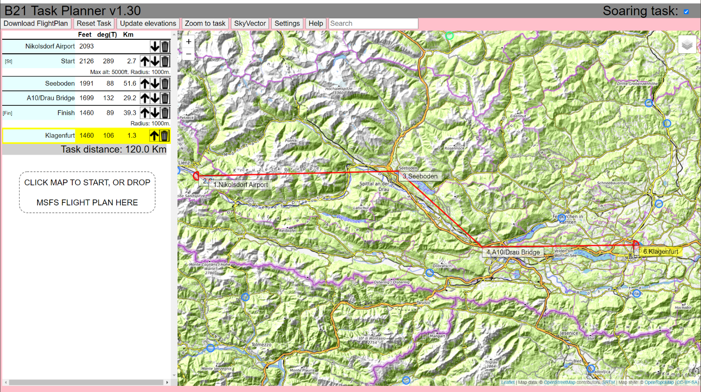

# B21 Task Planner for Microsoft Flight Simulator.

This browser-based 'app' is designed to create MSFS Flight Plans particularly suited to soaring flights. The objective is to produce a
tool with the minimum of clutter when your Flight Plan is simply Airport -> Waypoint -> ... -> Waypoint -> Airport.

B21 Task Planner supports a critical feature for soaring flights, which is to encode the waypoint ELEVATION into the waypoint NAME, e.g.
a waypoint "Burnt Cabins" can be saved as "Burnt Cabins+2340". This is to get around a legacy MSFS Flight Plan issue where the altitudes
set in the ".pln" file are ignored for intermediate waypoints.

Airports and waypoints you have set for your tasks are stored locally on your PC forming a database for subsequent tasks.

## Credits

B21 Task Planner uses:
* openstreetmap.org for the map
* leaflet for the map API
* mapbox for the map tiles
* open-elevation.com API to find the elevation at any lat/long
* LittleNavMap was used to extract the airports from MSFS, before converting to b21_task_planner.

