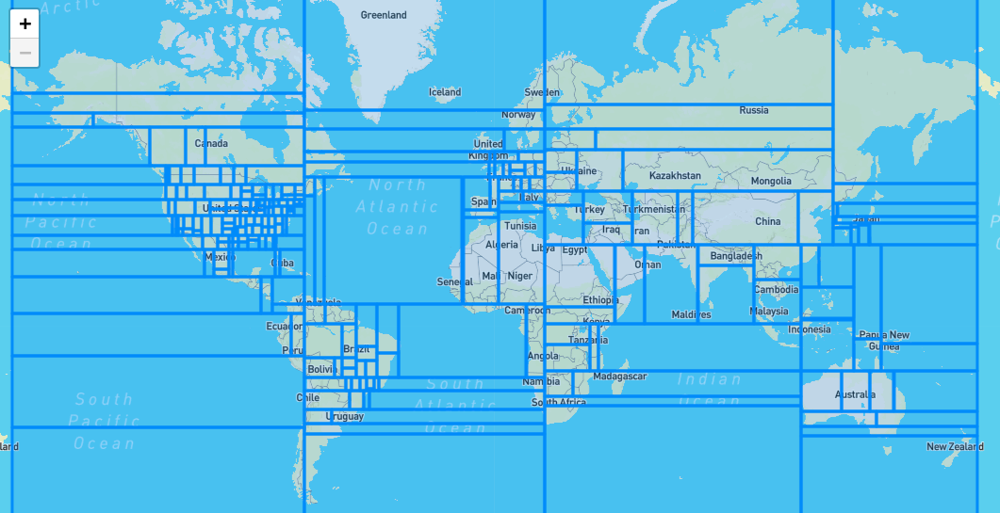

# The airports data for B21 Task Planner

We currently have two main sources for airports data:

1. Data is downloaded from the awesome guys at https://ourairports.com/data/
2. Data extracted from MSFS

## Ourairports data

Available from https://ourairports.com/data/

We download the ourairports.com 'airports.csv', then process that file by running `make_box_json.py` (e.g. use command "python make_box_json.py").

The input 'airports.csv' format is a linear set of records, one per airport (total 66000), with the columns describe below (from ourairports.com docs):

```
2021-08-21 = 66941 entries (624 large_airport)

Each row in this dataset represents the record for a single airport. The primary key for interoperability purposes with other datasets is ident,
but the actual internal OurAirports primary key is id. iso_region is a foreign key into the regions.csv download file.

Column	    Sample value	Description
id          2434	Internal OurAirports integer identifier for the airport. This will stay persistent, even if the airport code changes.
ident       EGLL	The text identifier used in the OurAirports URL. This will be the ICAO code if available. Otherwise, it will be a local airport code (if no conflict), or if nothing else is available, an internally-generated code starting with the ISO2 country code, followed by a dash and a four-digit number.
type        large_airport	The type of the airport. Allowed values are "closed_airport", "heliport", "large_airport", "medium_airport", "seaplane_base", and "small_airport". See the map legend for a definition of each type.
name	    London Heathrow Airport	The official airport name, including "Airport", "Airstrip", etc.
latitude_deg    51.470600	The airport latitude in decimal degrees (positive for north).
longitude_deg	-0.461941	The airport longitude in decimal degrees (positive for east).
elevation_ft	83	The airport elevation MSL in feet (not metres).
continent	EU	The code for the continent where the airport is (primarily) located. Allowed values are "AF" (Africa), "AN" (Antarctica), "AS" (Asia), "EU" (Europe), "NA" (North America), "OC" (Oceania), or "SA" (South America).
iso_country	GB	The two-character ISO 3166:1-alpha2 code for the country where the airport is (primarily) located. A handful of unofficial, non-ISO codes are also in use, such as "XK" for Kosovo. Points to the code column in countries.csv.
iso_region	GB-ENG	An alphanumeric code for the high-level administrative subdivision of a country where the airport is primarily located (e.g. province, governorate), prefixed by the ISO2 country code and a hyphen. OurAirports uses ISO 3166:2 codes whenever possible, preferring higher administrative levels, but also includes some custom codes. See the documentation for regions.csv.
municipality	London	The primary municipality that the airport serves (when available). Note that this is not necessarily the municipality where the airport is physically located.
scheduled_service	yes	"yes" if the airport currently has scheduled airline service; "no" otherwise.
gps_code	EGLL	The code that an aviation GPS database (such as Jeppesen's or Garmin's) would normally use for the airport. This will always be the ICAO code if one exists. Note that, unlike the ident column, this is not guaranteed to be globally unique.
iata_code	LHR	The three-letter IATA code for the airport (if it has one).
local_code		The local country code for the airport, if different from the gps_code and iata_code fields (used mainly for US airports).
home_link	http://www.heathrowairport.com/	URL of the airport's official home page on the web, if one exists.
wikipedia_link	https://en.wikipedia.org/wiki/Heathrow_Airport	URL of the airport's page on Wikipedia, if one exists.
keywords	LON, Londres	Extra keywords/phrases to assist with search, comma-separated. May include former names for the airport, alternate codes, names in other languages, nearby tourist destinations, etc.
```

## Reading the data from MSFS 2020

Here you need a PC with MSFS installed, and use [LittleNavMap](https://albar965.github.io/littlenavmap.html) to
read the data from MSFS into an SQLite database (i.e. file), and then use the SQLite command line to query the data
in the tables and output CSV.

### `make_merge_runways.py`
```
usage: make_merge_runways.py [-h] [--output_file OUTPUT_FILE] airport_file runway_file

positional arguments:
  airport_file          CSV file id,ident,type,name,lat,lng,elev_ft[,short_desc,long_desc]
  runway_file           CSV file ident,runway_name

optional arguments:
  -h, --help            show this help message and exit
  --output_file OUTPUT_FILE
                        CSV output file
```

Suitable queries will extract the Airports data and the Runways data (both as CSV), and then the program
`make_merge_runways.py` in this package can be used to append the runway information (just the names) onto
each airport CSV record. With input files `msfs_airports.csv` and `msfs_runways.csv` we produce the
output file `msfs_airports_runways.csv` which has one row per airport

## Structuring the data for fast access

Our objective is to create a data structure which speeds up searching for which airports should be drawn within a given map bounds. We do
this by segmenting the linear list of airports into a collection of equal-airport-count lat/long boxes, so the map display
algorithm can FIRST search the box
boundaries and choose which boxes overlap the map bounds, and then only display/search the airports within those boxes.



### `make_box_json.py`

```
usage: make_box_json.py [-h] [--input_file INPUT_FILE] [--output_file OUTPUT_FILE]

optional arguments:
  -h, --help            show this help message and exit
  --input_file INPUT_FILE
                        CSV file id,ident,type,name,lat,lng,elev_ft[,short_desc,long_desc]
  --output_file OUTPUT_FILE
                        json file to be written.
```

The current script set the MAX_AIRPORTS_PER_BOX to 500, which results in 256 boxes (it's always a power of 2) each with about 260 airports.

The output of 'make_box_json.py' is a JSON formatted object (suitable for reading into Javascript, or anything else that can parse JSON)
which has the airports divided into lat/long boxes that combined cover the earth but each box contains the same number of airports. I.e.
the boxes are all different sizes, but each contains the same number of airports.

The `max_box_json.py` source contains a constant `MAX_AIRPORTS_PER_BOX` (see top of file) which controls the eventual size of the
lat/long boxes.

The output file `airports.json` has the structure illustrated below, at the top level containing three entries:

`airport_keys`: explains which element in each airport entry is which, i.e. [ ident,lat,lng,name,type,elevation]
`box_coords`: a dictionary of each 'box_id' (e.g. "10101101") and the lat/long coordinates of that box.

```
{
    "airport_keys": {
        "ident": 0,
        "lat": 1,
        "lng": 2,
        "name": 3,
        "type": 4,
        "alt_m": 5
    },
    "box_coords": {
        "1000000": {
            "min_lat": -90,
            "max_lat": -28.3788890838623,
            "min_lng": -70.850703,
            "max_lng": -61.3842
        },
        "1000001": {
            "min_lat": -90,
            "max_lat": -28.3788890838623,
            "min_lng": -61.368224,
            "max_lng": -51.893518
        },
        ... then a load more of these 'box' definitions
    },
    "boxes": {
        "1000000": [
            [
                "SCKL",
                -33.331111907959,
                -70.8499984741211,
                "Lipangui Airport",
                "small_airport",
                474.87838480389166
            ],
            [
                "SHAE",
                -33.439722,
                -70.831389,
                "Aerorescate Heliport",
                "heliport",
                445.0079857597445
            ],
            ... then more airports for this box
        ]
        ... then a similar entry for all the boxes
    ]
```
